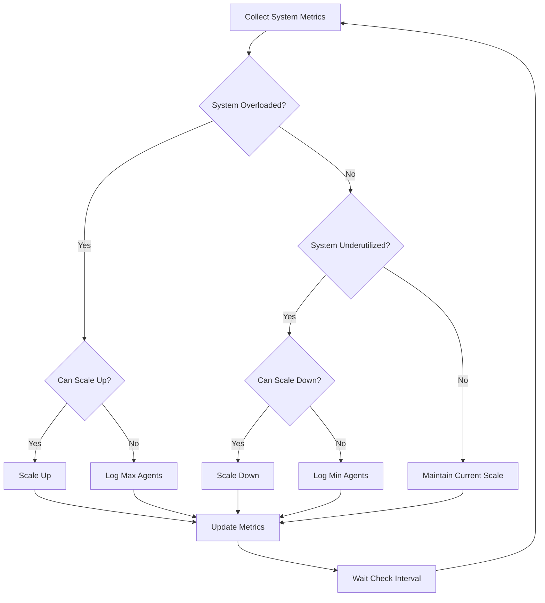

# Dynamic Scaling

The Dynamic Scaling component in PilottAI automatically adjusts the number of agents based on system load, ensuring optimal performance and resource utilization.

## Overview

Dynamic Scaling provides:

- Automatic agent scaling based on system metrics
- Resource-aware decision making
- Configurable thresholds and limits
- Controlled scaling with cooldown periods
- Comprehensive metrics and monitoring

## How It Works

Dynamic Scaling continuously monitors system metrics such as:

- Job queue size and utilization
- CPU and memory usage
- Agent load distribution
- Error rates and performance

Based on these metrics, it makes decisions to scale up (add agents) or scale down (remove agents) within configured limits.

## Basic Usage

### Enabling Dynamic Scaling

```python
import asyncio
from pilottai import Serve
from pilottai.core import LLMConfig

async def scaling_example():
    # Initialize PilottAI
    pilott = Serve(name="ScalingDemo")

    # Configure LLM
    llm_config = LLMConfig(
        model_name="gpt-4",
        provider="openai",
        api_key="your-api-key"
    )

    # Configure dynamic scaling
    scaling_config = {
        "min_agents": 2,
        "max_agents": 10,
        "scale_up_threshold": 0.8,
        "scale_down_threshold": 0.3,
        "cooldown_period": 300,  # 5 minutes
        "check_interval": 60     # 1 minute
    }

    # Start the system
    await pilott.start()

    try:
        # Enable dynamic scaling
        await pilott.enable_dynamic_scaling(config=scaling_config)

        # Add initial agents
        for i in range(2):
            await pilott.add_agent(
                title=f"worker_{i}",
                goal="Process jobs efficiently",
                llm_config=llm_config
            )

        # Generate load to test scaling
        jobs = []
        for i in range(20):
            jobs.append({
                "type": "process",
                "description": f"Process job {i}",
                "data": f"Sample data {i}"
            })

        # Execute jobs to generate load
        results = await pilott.execute(jobs)

        # Monitor metrics
        for i in range(5):
            metrics = await pilott.get_scaling_metrics()
            print(f"Scaling metrics: {metrics}")
            await asyncio.sleep(30)

    finally:
        # Always stop the system properly
        await pilott.stop()

if __name__ == "__main__":
    asyncio.run(scaling_example())
```

## Configuration Options

The `DynamicScaling` component accepts the following configuration parameters:

| Parameter | Type | Default | Description |
|-----------|------|---------|-------------|
| `scale_up_threshold` | float | 0.8 | System load threshold to trigger scaling up |
| `scale_down_threshold` | float | 0.3 | System load threshold to trigger scaling down |
| `min_agents` | int | 2 | Minimum number of agents to maintain |
| `max_agents` | int | 10 | Maximum number of agents allowed |
| `cooldown_period` | int | 300 | Seconds to wait between scaling operations |
| `check_interval` | int | 60 | Seconds between system metric checks |
| `scale_up_increment` | int | 1 | Number of agents to add when scaling up |
| `scale_down_increment` | int | 1 | Number of agents to remove when scaling down |
| `metrics_retention_period` | int | 3600 | Seconds to retain metric history |

## Scaling Metrics

You can monitor the dynamic scaling system using the `get_scaling_metrics()` method:

```python
scaling_metrics = await pilott.get_scaling_metrics()
```

The metrics include:

- Current system load
- Number of active agents
- CPU and memory usage
- Job queue size
- Load trend analysis
- Scaling history
- Cooldown status

## Scaling Process

The dynamic scaling process follows this workflow:



## Advanced Usage

### Custom Load Analysis

You can customize how the system calculates load by extending the `DynamicScaling` class:

```python
from pilottai.orchestration import DynamicScaling

class CustomScaling(DynamicScaling):
    async def _analyze_load_trend(self) -> float:
        # Custom load trend analysis
        if len(self.metrics_history) < 5:
            return 0.0

        # Use custom weighting
        recent_metrics = list(self.metrics_history)[-5:]
        job_density = sum(m.queue_size for m in recent_metrics) / len(recent_metrics)

        # Normalize by max queue size
        normalized_density = job_density / (len(self.orchestrator.child_agents) * 10)

        # Return custom load factor
        return min(1.0, normalized_density)
```

### Predictive Scaling

You can implement predictive scaling based on historical patterns:

```python
class PredictiveScaling(DynamicScaling):
    def __init__(self, orchestrator, config=None):
        super().__init__(orchestrator, config)
        self.hourly_patterns = {}
        self._load_historical_patterns()

    def _load_historical_patterns(self):
        # Load historical load patterns by hour
        # This could come from a file or database
        self.hourly_patterns = {
            9: 0.7,   # 9 AM typically has 70% load
            10: 0.8,  # 10 AM typically has 80% load
            # ... other hours
        }

    async def _check_and_adjust_scale(self):
        # Get current hour
        current_hour = datetime.now().hour

        # Get predicted load for this hour
        predicted_load = self.hourly_patterns.get(current_hour, 0.5)

        # Get actual load
        current_load = await self._get_system_load()

        # Use weighted combination of current and predicted load
        adjusted_load = (current_load * 0.7) + (predicted_load * 0.3)

        # Use adjusted load for scaling decisions
        if adjusted_load > self.config.scale_up_threshold:
            await self._scale_up()
        elif adjusted_load < self.config.scale_down_threshold:
            await self._scale_down()
```

## Integration with Load Balancing

Dynamic Scaling works seamlessly with the [Load Balancer](load-balancer.md) component:

```python
# Enable both dynamic scaling and load balancing
await pilott.enable_dynamic_scaling(config=scaling_config)
await pilott.enable_load_balancing(config=lb_config)
```

When both components are enabled:

1. Dynamic Scaling adjusts the number of agents based on system load
2. Load Balancer distributes jobs among available agents
3. Both components share monitoring data for better decisions

## Performance Considerations

- **Resource Overhead**: Dynamic Scaling adds a small overhead for metric collection
- **Scaling Latency**: New agents take time to initialize and start handling jobs
- **Cooldown Periods**: Prevent rapid scaling cycles that can cause system instability
- **Minimum Agents**: Maintain enough agents to handle baseline workload
- **Maximum Agents**: Set appropriate limits based on available system resources

## Best Practices

1. **Start Conservative**: Begin with modest scaling thresholds and adjust based on observations
2. **Monitor Carefully**: Keep track of scaling operations and their impact
3. **Tune Cooldown Periods**: Adjust based on your workload patterns
4. **Set Appropriate Limits**: Define realistic min/max agent counts
5. **Combine with Load Balancing**: Use both for optimal resource utilization

## API Reference

For a complete reference of all Dynamic Scaling methods and attributes, see the [Orchestration API](../api/orchestration.md) documentation.
