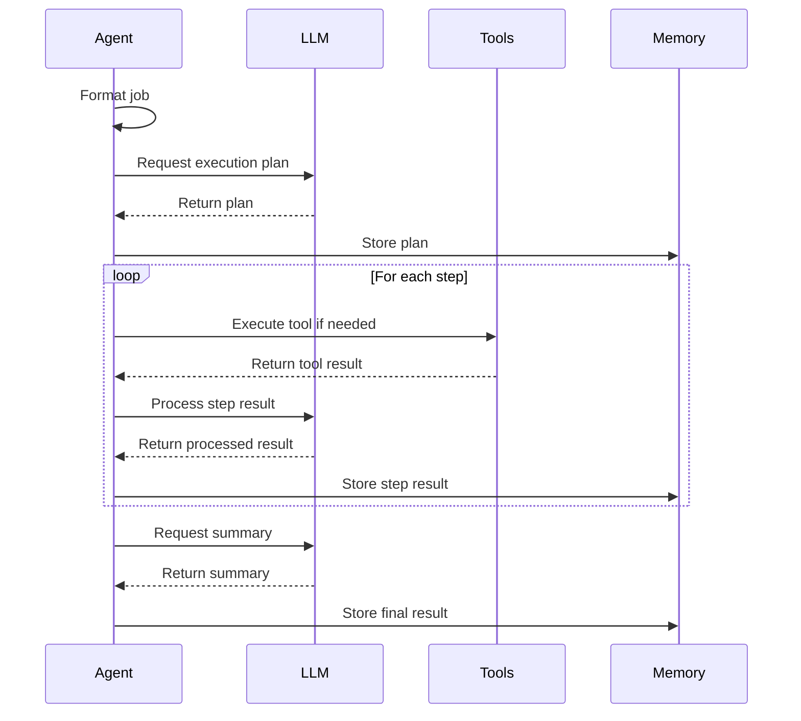

# Base Agent

The `BaseAgent` class is the foundation for all PilottAI agents. It provides the core functionality for job execution, tool management, and memory integration.

## Overview

The `BaseAgent` is responsible for:

- Executing jobs using LLMs
- Managing specialized tools
- Maintaining job context
- Tracking execution status
- Storing and retrieving memory

## Class Definition

```python
class BaseAgent:
    def __init__(
            self,
            config: AgentConfig,
            llm_config: Optional[LLMConfig] = None,
            tools: Optional[List[Tool]] = None,
            memory_enabled: bool = True
    ):
        # Core configuration
        self.config = config
        self.id = str(uuid.uuid4())

        # State management
        self.status = AgentStatus.IDLE
        self.current_job: Optional[Job] = None
        self._job_lock = asyncio.Lock()

        # Components
        self.tools = {tool.name: tool for tool in (tools or [])}
        self.memory = Memory() if memory_enabled else None
        self.llm = LLMHandler(llm_config) if llm_config else None

        # Setup logging
        self.logger = self._setup_logger()
```

## Configuration

The `BaseAgent` is configured using the `AgentConfig` class:

```python
from pilottai.core import AgentConfig, AgentType

config = AgentConfig(
    title="researcher",                  # Agent's title/type
    agent_type=AgentType.WORKER,         # Agent classification
    goal="Find accurate information",    # Main objective
    description="Research assistant",    # Brief description
    backstory=None,                      # Optional background story
    tools=["web_search", "text_analyzer"], # Available tools
    required_capabilities=[],            # Required capabilities
    max_iterations=20,                   # Maximum execution iterations
    memory_enabled=True,                 # Enable memory
    verbose=False                        # Verbose logging
)
```

## Key Methods

### Job Execution

```python
async def execute_job(self, job: Union[Dict, Job]) -> Optional[JobResult]:
    """Execute a job with proper handling and monitoring."""
    # Implementation details...
```

The job execution process involves:

1. Planning execution steps using LLM
2. Executing each step with proper error handling
3. Monitoring execution status and timeout
4. Recording execution in memory
5. Returning structured results

### Job Suitability Evaluation

```python
async def evaluate_job_suitability(self, job: Dict) -> float:
    """Evaluate how suitable this agent is for a job"""
    # Implementation details...
```

This method determines how well an agent can handle a specific job by:

- Checking required capabilities
- Matching job type with agent specializations
- Considering current agent load
- Analyzing job complexity

### Lifecycle Management

```python
async def start(self):
    """Start the agent"""
    # Implementation details...

async def stop(self):
    """Stop the agent"""
    # Implementation details...
```

These methods handle the agent's lifecycle, including:

- Initializing components
- Setting up connections
- Updating status
- Cleaning up resources

## Job Execution Pipeline

The `BaseAgent` follows a structured approach to job execution:

1. **Job Formatting**: Prepare job with context
2. **Execution Planning**: Generate a plan using LLM
3. **Step Execution**: Execute each step in the plan
4. **Tool Invocation**: Use tools as required
5. **Result Summarization**: Summarize and format results



## System Prompts

The `BaseAgent` uses system prompts to guide LLM behavior. The base system prompt follows this template:

```
You are an AI agent with:
Title: {title}
Goal: {goal}
Backstory: {backstory or 'No specific backstory.'}

Make decisions and take actions based on your title and goal.
```

## Error Handling

The `BaseAgent` implements robust error handling:

- Job timeouts
- LLM errors
- Tool execution failures
- Context validation

## Memory Integration

Agents maintain their own memory instance for:

- Job history tracking
- Context preservation
- Knowledge storage
- Pattern recognition

```python
# Store job in memory
await self.memory.store_job_start(
    job_id=job.id,
    description=job.description,
    agent_id=self.id
)

# Store result in memory
await self.memory.store_job_result(
    job_id=job.id,
    result=result,
    success=True,
    execution_time=execution_time,
    agent_id=self.id
)
```

## Extending BaseAgent

To create a specialized agent, extend the `BaseAgent` class:

```python
from pilottai.core import BaseAgent, AgentConfig

class ResearchAgent(BaseAgent):
    def __init__(self, config: AgentConfig, **kwargs):
        super().__init__(config, **kwargs)
        self.specializations = ["research", "information_gathering"]

    async def evaluate_job_suitability(self, job: Dict) -> float:
        # Custom suitability logic
        base_score = await super().evaluate_job_suitability(job)
        if job.get("type") == "research":
            return min(1.0, base_score + 0.3)
        return base_score
```

## Examples

### Creating a Basic Agent

```python
from pilottai.core import BaseAgent, AgentConfig, LLMConfig

# Configure LLM
llm_config = LLMConfig(
    model_name="gpt-4",
    provider="openai",
    api_key="your-api-key"
)

# Configure agent
config = AgentConfig(
    title="assistant",
    goal="Help with various jobs",
    description="General assistant agent"
)

# Create agent
agent = BaseAgent(config=config, llm_config=llm_config)
```

### Executing a Job

```python
# Create job
job = {
    "description": "Summarize the following text",
    "context": {
        "text": "PilottAI is a Python framework for building autonomous multi-agent systems..."
    }
}

# Execute job
result = await agent.execute_job(job)
print(f"Job result: {result.output}")
```

## API Reference

For a complete reference of all `BaseAgent` methods and attributes, see the [Agent API](../../api/agent.md) documentation.
