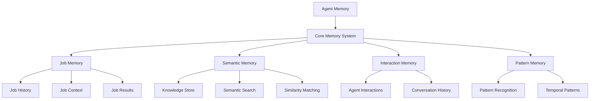

# Memory System

The PilottAI Memory System provides robust storage and retrieval capabilities for agents, enabling context preservation, knowledge persistence, and job history tracking.

## Overview

The Memory System is designed to:

- Maintain job execution history
- Store and retrieve semantic information
- Track agent interactions
- Provide context for future jobs
- Support search and similarity matching

## Memory Architecture

PilottAI implements a layered memory architecture:



## Basic Memory Usage

### Initializing Memory

```python
from pilottai.core import Memory

# Create a memory instance
memory = Memory()
```

### Storing Job Information

```python
# Store job start
await memory.store_job_start(
    job_id="job-123",
    description="Analyze sales data",
    agent_id="agent-456",
    context={"data_source": "sales_2023.csv"}
)

# Store job result
await memory.store_job_result(
    job_id="job-123",
    result={"insights": ["Sales increased by 20%", "Q4 was strongest"]},
    success=True,
    execution_time=2.5,
    agent_id="agent-456"
)

# Store job context
await memory.store_job_context(
    job_id="job-123",
    context={"additional_data": "competitor_analysis.csv"},
    context_type="data_source",
    agent_id="agent-456"
)
```

### Retrieving Job History

```python
# Get complete history for a job
job_history = await memory.get_job_history(
    job_id="job-123",
    include_context=True
)

# Get job result
job_result = await memory.get_job_result(
    job_id="job-123"
)
```

### Storing Semantic Information

```python
# Store semantic information with tags
await memory.store_semantic(
    text="Sales increased by 20% in Q4 2023 compared to Q4 2022",
    metadata={"topic": "sales", "period": "Q4 2023"},
    tags={"sales", "analysis", "quarterly"}
)
```

### Searching Memory

```python
# Search by text and tags
results = await memory.search(
    query="sales increase",
    tags={"analysis"},
    limit=5
)

# Get recent entries with tags
recent_entries = await memory.get_recent(
    tags={"sales"},
    limit=10
)
```

## Enhanced Memory

PilottAI also provides an `EnhancedMemory` class for advanced memory capabilities:

```python
from pilottai.memory import EnhancedMemory

# Create enhanced memory
enhanced_memory = EnhancedMemory()

# Store semantic information with priority and TTL
await enhanced_memory.store_semantic(
    text="Important sales insight: Q4 showed unexpected growth",
    metadata={"importance": "high"},
    tags={"sales", "priority"},
    priority=2,
    ttl=86400  # 24 hours
)

# Search with priority filter
results = await enhanced_memory.semantic_search(
    query="sales growth",
    tags={"sales"},
    min_priority=2,
    limit=5
)
```

## Job Memory

Job memory stores the complete history of job execution:

```python
# Build comprehensive job context
job_context = await memory.build_job_context(
    job_description="Analyze Q1 2024 sales data",
    agent_id="agent-456"
)

# Find similar jobs
similar_jobs = await memory.get_similar_jobs(
    job_description="Analyze sales performance",
    limit=3
)
```

## Memory Maintenance

PilottAI automatically manages memory with cleanup functionality:

```python
# Cleanup old entries
await memory.cleanup_old_entries(max_age_days=30)

# Clear all memory
await memory.clear()
```

## Memory Architecture Details

### Memory Entry

Each memory entry contains:

```python
class MemoryEntry(BaseModel):
    text: str
    entry_type: str  # 'job', 'context', 'result', etc.
    metadata: Dict[str, Any]
    timestamp: datetime
    tags: Set[str]
    priority: int
    job_id: Optional[str]
    agent_id: Optional[str]
```

### Memory Indices

The memory system maintains several indices for efficient retrieval:

- **Job Index**: Maps job IDs to related entries
- **Agent Index**: Maps agent IDs to related entries
- **Tag Index**: Maps tags to related entries
- **Timestamp Index**: Organizes entries chronologically
- **Priority Index**: Groups entries by priority level

### Memory Persistence

By default, memory is stored in-memory, but PilottAI supports persistence options:

```python
# Create memory with persistence
from pilottai.core import Memory

memory = Memory(
    persistence_enabled=True,
    persistence_path="./memory_store",
    persistence_interval=300  # Save every 5 minutes
)
```

## Advanced Memory Features

### Pattern Recognition

The enhanced memory system can identify patterns in stored information:

```python
# Store pattern
await enhanced_memory.store_pattern(
    name="sales_cycle",
    data={
        "pattern_type": "temporal",
        "period": "quarterly",
        "peak_months": ["March", "June", "September", "December"]
    },
    ttl=2592000  # 30 days
)

# Retrieve pattern
sales_pattern = await enhanced_memory.get_pattern("sales_cycle")
```

### Agent Interaction History

Track interactions between agents:

```python
# Store interaction
await enhanced_memory.store_interaction(
    agent_id="agent-123",
    interaction_type="delegation",
    data={
        "target_agent": "agent-456",
        "job_id": "job-789",
        "result": "success"
    }
)
```

### Job Context Building

Build rich context for new jobs based on history:

```python
# Build job context with similar jobs and agent history
context = await memory.build_job_context(
    job_description="Analyze customer churn for Q1 2024",
    agent_id="agent-123"
)
```

## Best Practices

1. **Use Tags Consistently**: Develop a consistent tagging schema for easy retrieval
2. **Prioritize Important Information**: Set higher priority for critical data
3. **Cleanup Regularly**: Implement regular cleanup for optimal performance
4. **Use TTL for Temporal Data**: Set time-to-live for information that expires
5. **Store Structured Metadata**: Use structured metadata for better searchability

## Example Workflow

Here's a complete example of memory usage in a multi-agent system:

```python
import asyncio
from pilottai import Serve
from pilottai.core import AgentConfig, LLMConfig
from pilottai.memory import EnhancedMemory

async def memory_example():
    # Initialize PilottAI
    pilott = Serve(name="MemoryDemo")

    # Configure LLM
    llm_config = LLMConfig(
        model_name="gpt-4",
        provider="openai",
        api_key="your-api-key"
    )

    # Start the system
    await pilott.start()

    try:
        # Add agents
        researcher = await pilott.add_agent(
            title="researcher",
            goal="Gather information",
            llm_config=llm_config
        )

        analyst = await pilott.add_agent(
            title="analyst",
            goal="Analyze information",
            llm_config=llm_config
        )

        # Store information in researcher's memory
        await researcher.memory.store_semantic(
            text="US GDP grew by 2.5% in 2023",
            metadata={"topic": "economics", "region": "US", "year": 2023},
            tags={"economics", "gdp", "us"}
        )

        # Execute research job
        research_result = await pilott.execute([{
            "type": "research",
            "description": "Research US economic growth",
            "agent": "researcher"
        }])

        # Store analysis in analyst's memory
        await analyst.memory.store_semantic(
            text="Analysis shows strong correlation between GDP growth and employment rates",
            metadata={"analysis_type": "correlation", "variables": ["gdp", "employment"]},
            tags={"analysis", "economics", "correlation"}
        )

        # Execute analysis job using context from previous research
        analysis_result = await pilott.execute([{
            "type": "analyze",
            "description": "Analyze impact of GDP growth on employment",
            "context": {"research_result": research_result[0].output},
            "agent": "analyst"
        }])

        # Retrieve similar analyses from memory
        similar_analyses = await analyst.memory.search(
            query="GDP employment correlation",
            tags={"analysis"},
            limit=3
        )

        print(f"Analysis result: {analysis_result[0].output}")
        print(f"Similar analyses: {similar_analyses}")

    finally:
        # Always stop the system properly
        await pilott.stop()

if __name__ == "__main__":
    asyncio.run(memory_example())
```

## API Reference

For a complete reference of all Memory System methods and attributes, see the [Memory API](../../api/memory.md) documentation.
