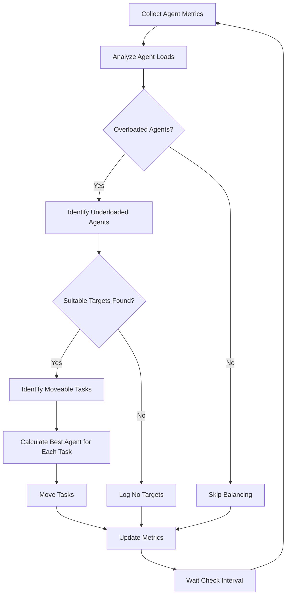

# Load Balancer

The Load Balancer component in PilottAI optimizes task distribution across agents, ensuring efficient resource utilization and preventing any single agent from becoming overloaded.

## Overview

The Load Balancer provides:

- Intelligent task distribution based on agent suitability
- Automatic redistribution of tasks from overloaded agents
- Agent load monitoring and analysis
- Performance-aware routing decisions
- Task prioritization and queue management

## How It Works

The Load Balancer continuously monitors agent loads and performance metrics to make informed decisions about:

- Which agent should handle each incoming task
- When to move tasks from overloaded to underutilized agents
- How to prioritize tasks based on importance and dependencies
- When to pause task acceptance for overloaded agents

## Basic Usage

### Enabling Load Balancing

```python
import asyncio
from pilott import Serve
from pilott.core import LLMConfig

async def load_balancing_example():
    # Initialize PilottAI
    pilott = Serve(name="LoadBalancingDemo")
    
    # Configure LLM
    llm_config = LLMConfig(
        model_name="gpt-4",
        provider="openai",
        api_key="your-api-key"
    )
    
    # Configure load balancer
    lb_config = {
        "check_interval": 30,           # 30 seconds between checks
        "overload_threshold": 0.8,      # 80% capacity is considered overloaded
        "underload_threshold": 0.2,     # 20% capacity is considered underloaded
        "max_tasks_per_agent": 10,      # Maximum tasks per agent
        "balance_batch_size": 3,        # Move up to 3 tasks at once
        "min_load_difference": 0.3      # Minimum load difference to trigger balancing
    }
    
    # Start the system
    await pilott.start()
    
    try:
        # Enable load balancing
        await pilott.enable_load_balancing(config=lb_config)
        
        # Add worker agents
        for i in range(5):
            await pilott.add_agent(
                role=f"worker_{i}",
                goal="Process tasks efficiently",
                llm_config=llm_config
            )
        
        # Create tasks with agent targeting to create imbalance
        tasks = []
        
        # Assign many tasks to worker_0 to create imbalance
        for i in range(15):
            tasks.append({
                "type": "process",
                "description": f"Process task {i}",
                "data": f"Sample data {i}",
                "agent": "worker_0"  # Target specific agent
            })
        
        # Execute tasks (this will overload worker_0)
        results = await pilott.execute(tasks)
        
        # Monitor load balancing
        for i in range(5):
            metrics = await pilott.get_load_balancing_metrics()
            print(f"Load balancing metrics: {metrics}")
            await asyncio.sleep(30)
    
    finally:
        # Always stop the system properly
        await pilott.stop()

if __name__ == "__main__":
    asyncio.run(load_balancing_example())
```

## Configuration Options

The `LoadBalancer` component accepts the following configuration parameters:

| Parameter | Type | Default | Description |
|-----------|------|---------|-------------|
| `check_interval` | int | 30 | Seconds between load balance checks |
| `overload_threshold` | float | 0.8 | Load threshold to consider an agent overloaded |
| `underload_threshold` | float | 0.2 | Load threshold to consider an agent underutilized |
| `max_tasks_per_agent` | int | 10 | Maximum tasks per agent |
| `balance_batch_size` | int | 3 | Maximum tasks to move in one balancing operation |
| `min_load_difference` | float | 0.3 | Minimum load difference to trigger task movement |
| `metrics_retention_period` | int | 3600 | Seconds to retain metric history |
| `task_move_timeout` | int | 30 | Seconds to wait for task movement to complete |

## Load Balancing Metrics

You can monitor the load balancing system using the `get_load_balancing_metrics()` method:

```python
lb_metrics = await pilott.get_load_balancing_metrics()
```

The metrics include:

- Number of active agents
- Number of overloaded agents
- Number of underloaded agents
- Last balance operation time
- Agent load distribution
- Task movement history
- Queue utilization per agent

## Load Balancing Process

The load balancing process follows this workflow:



## Task Suitability Scoring

The Load Balancer uses a comprehensive scoring system to determine the best agent for each task:

```python
async def _calculate_agent_suitability(self, agent, task, metrics):
    """Calculate comprehensive agent suitability score"""
    
    # Base capability score (0.0-1.0)
    base_score = await agent.evaluate_task_suitability(task)
    
    # Load penalty (lower is better)
    load_score = 1 - self._calculate_composite_load(metrics)
    
    # Performance score (higher is better)
    perf_score = 1 - metrics.error_rate
    
    # Resource availability (higher is better)
    resource_score = 1 - max(metrics.cpu_usage, metrics.memory_usage)
    
    # Calculate weighted total score
    return (
        base_score * 0.4 +
        load_score * 0.3 +
        perf_score * 0.2 +
        resource_score * 0.1
    )
```

This scoring considers:

1. **Task-Agent Match**: How suitable the agent is for the specific task
2. **Current Load**: How busy the agent currently is
3. **Historical Performance**: How well the agent has performed on similar tasks
4. **Resource Availability**: CPU and memory availability on the agent

## Advanced Usage

### Task Movement Control

You can mark certain tasks as unmovable:

```python
# Create task that should not be moved by load balancer
task = {
    "type": "critical_process",
    "description": "Process critical data",
    "data": "Important information",
    "unmoveable": True  # This task won't be moved by the load balancer
}
```

### Custom Load Metrics

You can customize how agent load is calculated:

```python
from pilott.orchestration import LoadBalancer

class CustomLoadBalancer(LoadBalancer):
    def _calculate_composite_load(self, metrics):
        """Custom load calculation with emphasis on queue size"""
        return (
            0.2 * metrics.cpu_usage +
            0.2 * metrics.memory_usage +
            0.5 * (metrics.queue_size / self.config.max_tasks_per_agent) +
            0.1 * metrics.error_rate
        )
```

### Task Prioritization

Tasks with higher priority will be preserved during load balancing:

```python
# Create high-priority task
high_priority_task = {
    "type": "urgent_process",
    "description": "Process urgent data",
    "data": "Critical information",
    "priority": "high"
}

# Create normal-priority task
normal_task = {
    "type": "regular_process",
    "description": "Process regular data",
    "data": "Standard information",
    "priority": "medium"
}
```

When an agent becomes overloaded, lower-priority tasks will be moved first.

## Integration with Dynamic Scaling

The Load Balancer works seamlessly with the [Dynamic Scaling](dynamic-scaling.mdx) component:

```python
# Enable both load balancing and dynamic scaling
await pilott.enable_load_balancing(config=lb_config)
await pilott.enable_dynamic_scaling(config=scaling_config)
```

When both components are enabled:

1. Load Balancer redistributes tasks to optimize current resources
2. Dynamic Scaling adds or removes agents based on overall system load
3. Both components share monitoring data for better decisions

## Performance Considerations

- **Resource Overhead**: Load balancing adds a small overhead for metric collection and analysis
- **Task Movement Cost**: Moving tasks between agents has an overhead cost
- **Safe Mode**: By default, load balancer operates in safe mode to prevent data loss
- **Batch Processing**: Tasks are moved in batches to reduce overhead
- **Queue Limits**: Respect maximum queue size limits to prevent memory issues

## Best Practices

1. **Tune Thresholds**: Adjust overload and underload thresholds based on your workload
2. **Set Appropriate Batch Size**: Larger batch sizes reduce balancing frequency but increase impact
3. **Monitor Carefully**: Keep track of task movements and their impact
4. **Mark Critical Tasks**: Use the `unmoveable` flag for critical tasks that shouldn't be disrupted
5. **Combine with Dynamic Scaling**: Use both for optimal resource utilization

## API Reference

For a complete reference of all Load Balancer methods and attributes, see the [Orchestration API](../api/orchestration.md) documentation.
