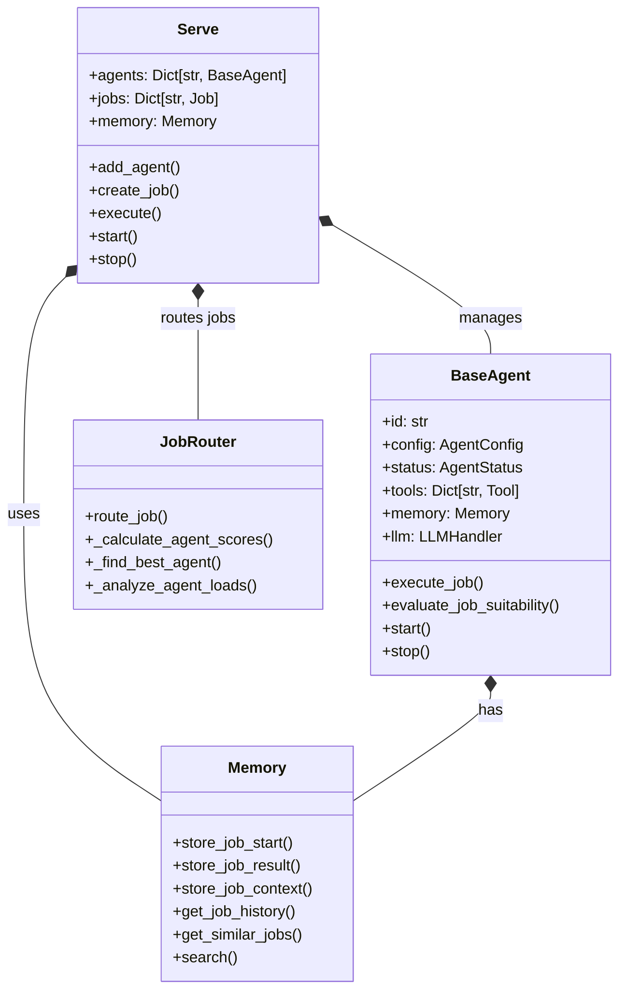
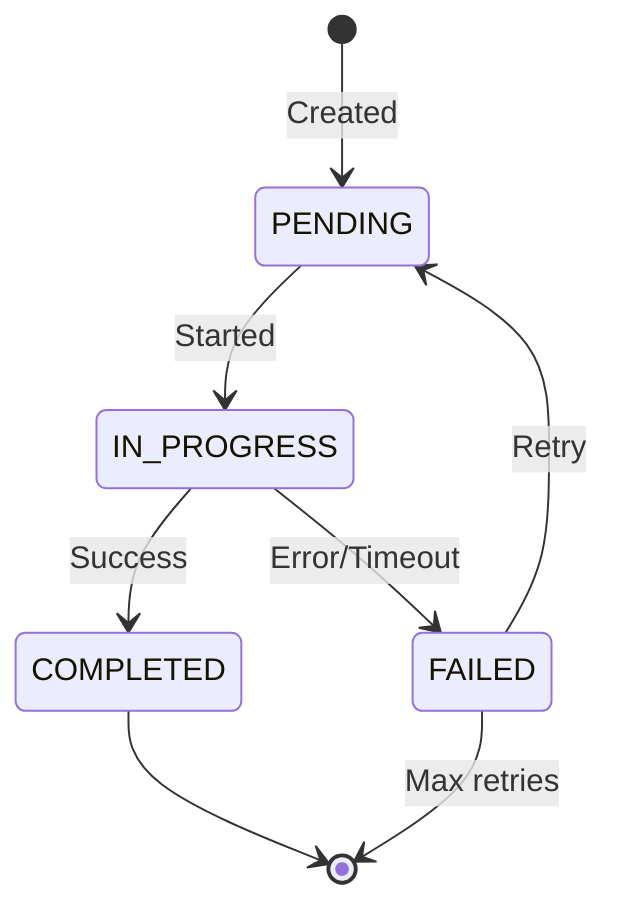

# Basic Concepts

This guide introduces the core concepts of the PilottAI framework.

## Framework Architecture

PilottAI is designed around a modular, hierarchical architecture:



### Core Components

1. **Serve**: The main orchestrator that manages agents, routes jobs, and coordinates execution.

2. **Agents**: Autonomous entities that perform specific jobs using LLMs and tools.

3. **Jobs**: Units of work that are routed to appropriate agents for execution.

4. **Memory**: Storage system for context, job history, and knowledge.

5. **Tools**: Integrations and capabilities that agents can use to accomplish jobs.

6. **Orchestration**: Systems for scaling, load balancing, and fault tolerance.

## Agents

Agents are the primary actors in the PilottAI framework. Each agent:

- Has a specific title and goal
- Can use tools to interact with external systems
- Utilizes LLMs for decision-making and job execution
- Maintains its own memory and context

### Agent Types

PilottAI supports different agent types:

- **Orchestrator**: Manages and delegates jobs to worker agents
- **Worker**: Executes specific jobs using specialized capabilities
- **Hybrid**: Combines orchestration and execution capabilities

### Agent Configuration

Agents are configured using the `AgentConfig` class:

```python
from pilottai.core import AgentConfig, AgentType

config = AgentConfig(
    title="document_processor",          # Agent's title/type
    agent_type=AgentType.WORKER,         # Agent classification
    goal="Process documents efficiently", # Main objective
    description="Document processing worker", # Brief description
    backstory=None,                      # Optional background story
    knowledge_sources=[],                # Available knowledge sources
    tools=["text_extractor"],            # Available tools
    required_capabilities=[],            # Required capabilities
    max_iterations=20,                   # Maximum execution iterations
    max_rpm=None,                        # Rate limits
    memory_enabled=True,                 # Enable memory
    verbose=False                        # Verbose logging
)
```

## Jobs

Jobs represent units of work that agents perform. Each job:

- Has a description and context
- May be assigned to a specific agent or automatically routed
- Has a priority level
- Tracks execution status and results

### Job Lifecycle



### Job Creation

```python
from pilottai.core import Job, JobPriority

job = Job(
    description="Extract key information from document",
    priority=JobPriority.HIGH,
    context={"file_path": "document.pdf"}
)
```

## Memory System

PilottAI includes a sophisticated memory system that:

- Stores job execution history
- Maintains agent context
- Enables semantic search and retrieval
- Supports knowledge persistence

### Memory Components

1. **Job Memory**: Records job execution details
2. **Semantic Memory**: Stores knowledge and context
3. **Enhanced Memory**: Advanced memory with pattern recognition

### Using Memory

```python
# Store information in semantic memory
await agent.memory.store_semantic(
    text="Important information about topic X",
    metadata={"topic": "X", "importance": "high"},
    tags={"research", "topic_x"}
)

# Search memory
results = await agent.memory.search(
    query="topic X",
    tags={"research"}
)
```

## LLM Integration

PilottAI uses Large Language Models for agent intelligence. Key concepts:

1. **LLM Configuration**: Settings for model, provider, and parameters
2. **LLM Handler**: Manages LLM interactions with proper error handling
3. **Function Calling**: Structured LLM output for tool use

### LLM Configuration

```python
from pilottai.core import LLMConfig

llm_config = LLMConfig(
    model_name="gpt-4",
    provider="openai",
    api_key="your-api-key",
    temperature=0.7,
    max_tokens=2000
)
```

## Tools

Tools extend agent capabilities by providing:

- External system integrations
- Specialized functionality
- Job-specific utilities

### Tool Creation

```python
from pilottai.tools import Tool

email_tool = Tool(
    name="email_sender",
    description="Send emails to recipients",
    function=lambda **kwargs: send_email(**kwargs),
    parameters={
        "to": "str",
        "subject": "str",
        "body": "str"
    }
)
```

## Orchestration

PilottAI includes advanced orchestration features:

### Dynamic Scaling

Automatically adjusts the number of agents based on system load:

```python
await pilott.enable_dynamic_scaling(
    config={
        "min_agents": 2,
        "max_agents": 10,
        "scale_up_threshold": 0.8,
        "scale_down_threshold": 0.3
    }
)
```

### Load Balancing

Distributes jobs across agents to optimize performance:

```python
await pilott.enable_load_balancing(
    config={
        "check_interval": 30,
        "overload_threshold": 0.7
    }
)
```

### Fault Tolerance

Handles agent failures and ensures system reliability:

```python
await pilott.enable_fault_tolerance(
    config={
        "health_check_interval": 30,
        "max_recovery_attempts": 3
    }
)
```

## Next Steps

Now that you understand the basic concepts of PilottAI, you can:

- Explore specialized [Agents](../core/agents/base-agent.md)
- Learn about [Memory Systems](../core/memory/overview.md)
- Dive into [Orchestration](../orchestration/overview.md) features
- See [Examples](../examples/basic.md) of PilottAI in action
