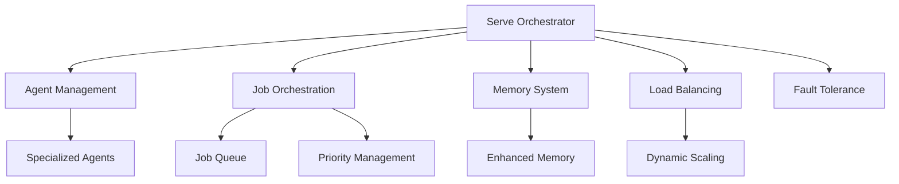

# PilottAI Framework

Build scalable multi-agent systems with powerful orchestration, LLM integration, and job processing capabilities.

<div class="cta-buttons">
<a href="getting-started/installation/" class="md-button md-button--primary">Get Started</a>
<a href="https://github.com/anuj0456/pilottai" class="md-button">GitHub</a>
</div>

## What is PilottAI?

PilottAI is a Python framework for building autonomous multi-agent systems with advanced orchestration capabilities. It provides enterprise-ready features for building scalable AI applications powered by large language models.

<div class="home-grid">
<div class="home-card">
<div class="home-card-icon">🤖</div>
<h3>Hierarchical Agent System</h3>
<ul class="feature-list">
<li>Manager and worker agent hierarchies</li>
<li>Intelligent job routing</li>
<li>Context-aware processing</li>
<li>Specialized agent implementations</li>
</ul>
</div>

<div class="home-card">
<div class="home-card-icon">🚀</div>
<h3>Production Ready</h3>
<ul class="feature-list">
<li>Asynchronous processing</li>
<li>Dynamic scaling</li>
<li>Load balancing</li>
<li>Fault tolerance</li>
<li>Comprehensive logging</li>
</ul>
</div>

<div class="home-card">
<div class="home-card-icon">🧠</div>
<h3>Advanced Memory</h3>
<ul class="feature-list">
<li>Semantic storage</li>
<li>Job history tracking</li>
<li>Context preservation</li>
<li>Knowledge retrieval</li>
</ul>
</div>

<div class="home-card">
<div class="home-card-icon">🔌</div>
<h3>Integrations</h3>
<ul class="feature-list">
<li>Multiple LLM providers</li>
<li>Document processing</li>
<li>WebSocket support</li>
<li>Custom tool integration</li>
</ul>
</div>
</div>

## Installation

```bash
pip install pilottai
```

## Quick Start

```python
from pilottai import Serve
from pilottai.core import AgentConfig, AgentType, LLMConfig

# Configure LLM
llm_config = LLMConfig(
    model_name="gpt-4",
    provider="openai",
    api_key="your-api-key"
)

# Setup agent configuration
config = AgentConfig(
    title="processor",
    agent_type=AgentType.WORKER,
    goal="Process documents efficiently",
    description="Document processing worker"
)

async def main():
    # Initialize system
    pilott = Serve(name="DocumentProcessor")

    try:
        # Start system
        await pilott.start()

        # Add agent
        agent = await pilott.add_agent(
            agent_type="processor",
            config=config,
            llm_config=llm_config
        )

        # Process document
        result = await pilott.execute_job({
            "type": "process_document",
            "file_path": "document.pdf"
        })

        print(f"Processing result: {result}")

    finally:
        await pilott.stop()

if __name__ == "__main__":
    import asyncio
    asyncio.run(main())
```

## Specialized Agents

<div class="agent-grid">
<a href="core/agents/customer-service/" class="agent-card">
<div class="agent-card-icon">🎫</div>
<h4>Customer Service</h4>
<p>Ticket and support management</p>
</a>

<a href="core/agents/document-processing/" class="agent-card">
<div class="agent-card-icon">📄</div>
<h4>Document Processing</h4>
<p>Document analysis and extraction</p>
</a>

<a href="core/agents/email-agent/" class="agent-card">
<div class="agent-card-icon">📧</div>
<h4>Email Agent</h4>
<p>Email handling and templates</p>
</a>

<a href="core/agents/learning-agent/" class="agent-card">
<div class="agent-card-icon">🧠</div>
<h4>Learning Agent</h4>
<p>Knowledge acquisition and patterns</p>
</a>

<a href="core/agents/marketing-expert/" class="agent-card">
<div class="agent-card-icon">📢</div>
<h4>Marketing Expert</h4>
<p>Campaign and content creation</p>
</a>

<a href="core/agents/research-analyst/" class="agent-card">
<div class="agent-card-icon">📊</div>
<h4>Research Analyst</h4>
<p>Data analysis and synthesis</p>
</a>

<a href="core/agents/sales-rep/" class="agent-card">
<div class="agent-card-icon">💼</div>
<h4>Sales Rep</h4>
<p>Lead management and proposals</p>
</a>

<a href="core/agents/social-media-agent/" class="agent-card">
<div class="agent-card-icon">🌐</div>
<h4>Social Media</h4>
<p>Content scheduling and engagement</p>
</a>

<a href="core/agents/web-search/" class="agent-card">
<div class="agent-card-icon">🔍</div>
<h4>Web Search</h4>
<p>Search operations and analysis</p>
</a>
</div>

## Architecture

PilottAI is built around a core orchestration system that manages agents, jobs, and memory.



## Next Steps

<div class="next-steps">
<div class="next-step-card">
<h4>Installation Guide</h4>
<p>Learn how to install PilottAI and its dependencies.</p>
<a href="getting-started/installation/">Installation →</a>
</div>

<div class="next-step-card">
<h4>Quick Start Guide</h4>
<p>Build your first multi-agent system with PilottAI.</p>
<a href="getting-started/quickstart/">Quick Start →</a>
</div>

<div class="next-step-card">
<h4>Core Concepts</h4>
<p>Understand the fundamental concepts of the framework.</p>
<a href="getting-started/concepts/">Learn Concepts →</a>
</div>

<div class="next-step-card">
<h4>Example Projects</h4>
<p>Explore real-world examples using PilottAI.</p>
<a href="examples/basic/">View Examples →</a>
</div>
</div>
